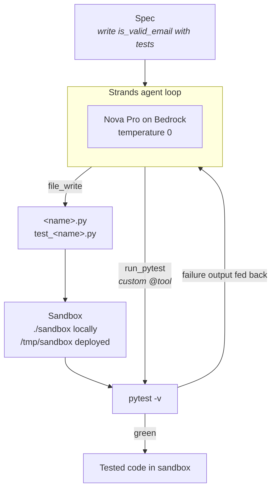

# spec-to-code-using-strands-agents

**A hands-on project for learning [Strands Agents](https://strandsagents.com) — the code-first agent SDK — and deploying one to [Amazon Bedrock AgentCore Runtime](https://docs.aws.amazon.com/bedrock-agentcore/).**

Give the agent a small Python function spec. It writes the implementation and its own pytest tests, runs them, reads the real failure output, fixes what broke, and repeats until green. Then the same agent runs as a live AWS endpoint.

The point isn't the coding problem — it's the framework. You write the agent loop in Python instead of declaring it in config, which means you control the tools, the state and the retry behaviour directly.

## Architecture



The loop stops when the model returns a response with no tool call, or when the `turns` cap trips — whichever comes first.

Two ways to run the identical agent:

| | Local | Deployed |
|---|---|---|
| Entry | `agents/get_agent()` | `main.py` `@app.entrypoint` |
| Server | `agentcore dev` (web chat UI) | AgentCore Runtime, CodeZip |
| Sandbox | `./sandbox/` | `/tmp/sandbox/` — `/var/task` is read-only |
| Invoke | web UI or a Python call | `agentcore invoke` or boto3 |

## Table of Contents

- [Architecture](#architecture)
- [Project Overview & Features](#project-overview--features)
- [Test It Locally](#test-it-locally)
- [Deep Dives](#deep-dives)
- [Build It](#build-it)

## Project Overview & Features

```
app/specToCodeUsingStrands/
├── main.py                       AgentCore Runtime entrypoint
├── agents/spec_to_code_agent.py  system prompt + agent factory
├── tools/pytest_tools.py         run_pytest, a custom @tool
├── paths.py                      resolves a writable sandbox
├── model/load.py                 BedrockModel config
└── sandbox/                      generated code lands here

agentcore/
├── agentcore.json                project manifest (runtimes, memories, ...)
├── aws-targets.example.json      template; real file is generated
└── cdk/                          CDK app the CLI deploys
```

**What it does**

- Turns a one-line function spec into an implementation plus pytest tests
- Runs the tests itself and feeds real failure output back into the loop
- Bounded retries via Strands' `limits={"turns": N}` — an SDK-enforced cap, not just a prompt instruction
- Streams tokens over SSE, so a frontend can consume it
- Resolves its own writable sandbox, because deployed runtimes mount the working directory read-only

**Stack**

- `strands-agents` for the agent loop, `strands-agents-tools` for `file_write`
- Amazon Nova Pro (`us.amazon.nova-pro-v1:0`) via Bedrock in `us-east-1`
- `bedrock-agentcore` for the Runtime contract, `@aws/agentcore` CLI for deployment

## Test It Locally

Prerequisites: Python 3.10+, Node 20+, AWS credentials, and Bedrock model access for Nova Pro in `us-east-1`.

Install dependencies:

```bash
pip install strands-agents strands-agents-tools bedrock-agentcore pytest
```

Run the agent directly, no server:

```bash
cd app/specToCodeUsingStrands && python3 -c "
from agents import get_agent
r = get_agent()('Spec: write a function slugify(text: str) -> str that lowercases text, replaces spaces with hyphens, and strips non-alphanumeric characters. Cover: mixed case, punctuation, multiple spaces.')
print(r.message)
"
```

You'll see each tool call as it happens. Then confirm the tests genuinely pass rather than trusting the agent's summary:

```bash
cd app/specToCodeUsingStrands/sandbox && python3 -m pytest -q
```

Or run it as a local server with a web chat UI:

```bash
agentcore dev
```

## Deep Dives

Official docs for each concept this project uses.

**The SDK**

| Concept | Where it shows up here | Docs |
|---|---|---|
| First agent, `BedrockModel` | `model/load.py` | [Python quickstart](https://strandsagents.com/docs/user-guide/sdk/quickstart/python/) · [Bedrock provider](https://strandsagents.com/docs/user-guide/sdk/model-providers/amazon-bedrock/) |
| Agent loop | why the loop stops with no tool call | [Agent loop](https://strandsagents.com/docs/user-guide/sdk/agents/agent-loop/) |
| State across turns | `get_agent()` caching one instance | [State](https://strandsagents.com/docs/user-guide/sdk/agents/state/) |
| Streaming | `main.py` yielding `event["data"]` | [Streaming](https://strandsagents.com/docs/user-guide/sdk/streaming/) |
| Built-in tools | `file_write` | [Tools](https://strandsagents.com/docs/user-guide/sdk/tools/) · [tools repo](https://github.com/strands-agents/tools) |
| Custom `@tool` | `tools/pytest_tools.py` | [Custom tools](https://strandsagents.com/docs/user-guide/sdk/tools/custom-tools/) |
| Memory / sessions | not used here — removed before deploy | [Memory](https://strandsagents.com/docs/user-guide/sdk/memory/overview/) |
| Production concerns | — | [Operating agents in production](https://strandsagents.com/docs/user-guide/sdk/deploy/operating-agents-in-production/) |

**AgentCore Runtime**

- [Get started with the AgentCore CLI](https://docs.aws.amazon.com/bedrock-agentcore/latest/devguide/runtime-get-started-cli.html) — `create` / `dev` / `deploy` / `invoke`
- [Get started with Amazon Bedrock AgentCore](https://docs.aws.amazon.com/bedrock-agentcore/latest/devguide/agentcore-get-started-cli.html)
- [IAM permissions](https://docs.aws.amazon.com/bedrock-agentcore/latest/devguide/runtime-permissions.html) — deploy-time and execution-role permissions are separate, and this is where first deploys usually fail
- [Deploy without the CLI](https://docs.aws.amazon.com/bedrock-agentcore/latest/devguide/getting-started-custom.html) — the manual FastAPI `/invocations` + `/ping` contract that `BedrockAgentCoreApp` handles for you
- [aws/agentcore-cli](https://github.com/aws/agentcore-cli) — CLI source; check here when docs and flags diverge
- [awslabs/agentcore-samples](https://github.com/awslabs/agentcore-samples) — the Strands + Runtime reference this project's `main.py` follows

> The AgentCore deployment CLI changed recently. The deprecated pip `bedrock-agentcore-starter-toolkit` used `agentcore configure` / `agentcore launch`; the current npm `@aws/agentcore` uses `create` / `dev` / `deploy` / `invoke`. Older tutorials and videos may show the old commands.

## Build It

Install the CLI (npm, not pip):

```bash
npm install -g @aws/agentcore
```

Generate your deployment target. `aws-targets.json` is gitignored because it carries your AWS account ID, and the CLI validates that field against `^[0-9]{12}$`, so a `${AWS_ACCOUNT_ID}` placeholder won't pass:

```bash
sed "s/\${AWS_ACCOUNT_ID}/$(aws sts get-caller-identity --query Account --output text)/" agentcore/aws-targets.example.json > agentcore/aws-targets.json
```

Validate, then preview — the dry run surfaces missing IAM permissions and CDK bootstrap gaps before anything is created:

```bash
agentcore validate && agentcore deploy --dry-run
```

Deploy. This creates a CloudFormation stack, an ECR repository, a CodeBuild project, and both IAM roles:

```bash
agentcore deploy
```

Confirm and invoke:

```bash
agentcore status
```

```bash
agentcore invoke "Spec: write a function word_count(text: str) -> int returning the number of whitespace-separated words. Cover: empty string, single word, multiple spaces."
```

Inspect what the agent actually wrote inside the container. The sandbox is ephemeral and per-session, so pin the session ID from the invoke output:

```bash
agentcore exec --runtime specToCodeUsingStrands --session-id <session-id> "ls /tmp/sandbox"
```

Logs:

```bash
agentcore logs
```

## License

MIT — see [LICENSE](LICENSE).
